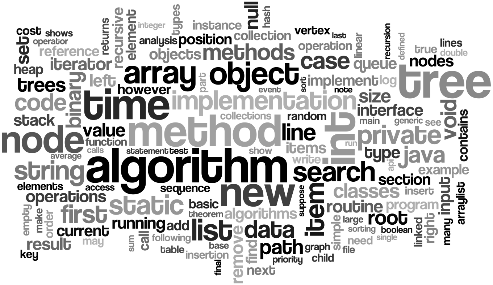

# Java - Data Structure and Algorithms and LeetCode Problems

This repo contains the collection of java collections notes and leetcode coding challenges exercises that I am currently studying to learn more about Data Structure and Algorithms. This repo will be updated progressively.



## Coding Challenges

The data structure and algorithms concepts and theories, and java methods, core java learnt from each week are detailed under each **_Weekly Learning Summary_**.

**Table of Contents**

```
      -------------------------------
      Week - 1 W1_Strings
           1. 344. Reverse String
           2. 125. Valid Palindrome
           3. 657. Robot Return to Origin
           4. 520. Detect Capital
           5. 67. Add Binary
           6. 14. Longest Common Prefix
           7. 680. Valid Palindrome II
      -------------------------------
      Week -2 Array and ArrayList 
      -------------------------------

```

## Weekly Learning Summary

### Week -1 W1_Strings 

In this week, the data structure is **W1_Strings**. Therefore 7 leetcode easy String questions were selected for practice. The problems numbers and links are below.

1. <a href="https://leetcode.com/problems/reverse-string/" target="_blank">344. Reverse String</a>
2. <a href="https://leetcode.com/problems/valid-palindrome/" target="_blank">125. Valid Palindrome</a>
3. <a href="https://leetcode.com/problems/robot-return-to-origin/" target="_blank">657. Robot Return to Origin</a>
4. <a href="https://leetcode.com/problems/detect-capital/" target="_blank">520. Detect Capital</a>
5. <a href="https://leetcode.com/problems/add-binary/" target="_blank">67. Add Binary</a>
6. <a href="https://leetcode.com/problems/longest-common-prefix/" target="_blank">14. Longest Common Prefix</a>
7. <a href="https://leetcode.com/problems/valid-palindrome-ii/" target="_blank">680. Valid Palindrome II</a>


The coding solutions are in the [String folder](src/W1_Strings).
### Java W1_Strings Methods

- [String methods](https://www.tutorialspoint.com/java/lang/java_lang_string.htm)

- **[java.lang.Character.isLetterOrDigit(char ch)](https://www.tutorialspoint.com/java/lang/character_isletterordigit.htm)**
  - The java.lang.Character.isLetterOrDigit(char ch) determines if the specified character is a letter or digit.
  - A character is considered to be a letter or digit if either Character.isLetter(char ch) or Character.isDigit(char ch) returns true for the character.
  - String.charAt(i)
- **Two Pointer Technique - one of the techniques**

  - int pointer i, increment
  - int pointer j, decrement

- **[java.lang.String.valueOf(char[] data)](https://www.tutorialspoint.com/java/lang/string_valueof_chararray.htm)**

  - The java.lang.String.valueOf(char[] data) method returns the string representation of the char array argument.
  - The contents of the character array are copied and subsequent modification of the character array does not affect the newly created string.

- \***[String toCharArray() Method](https://beginnersbook.com/2013/12/java-string-tochararray-method-example/)**\*\*

  - The method toCharArray() returns an Array of chars after converting a String into sequence of characters.
  - The returned array length is equal to the length of the String and the sequence of chars in Array matches the sequence of characters in the String.

```
    public class CharArrayExample{
        public static void main(String args[]){
                String str = new String("Welcome to BeginnersBook.com");
                char[] array= str.toCharArray();
                System.out.print("Content of Array:");
                for(char c: array){
                    System.out.print(c);
                }
            }
    }
```


### References

- Java.lang.Character.isLetterOrDigit() Method, https://www.tutorialspoint.com/java/lang/character_isletterordigit.htm
- Java tutorial: Learn Java Programming with examples, https://beginnersbook.com/java-tutorial-for-beginners-with-examples/
- Nick White YouTube channel, https://www.youtube.com/watch?v=U6-X_QOwPcs&list=PLU_sdQYzUj2keVENTP0a5rdykRSgg9Wp-
- Kevin Naughton Jr YouTubr channel, https://www.youtube.com/c/KevinNaughtonJr/playlists
- Programming Notes, https://www3.ntu.edu.sg/home/ehchua/programming/index.html#Java
  
