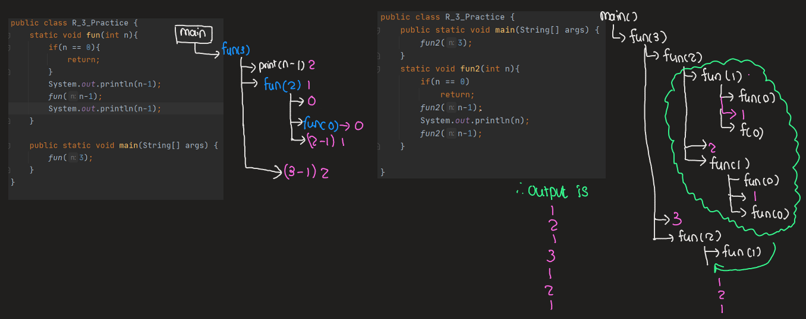
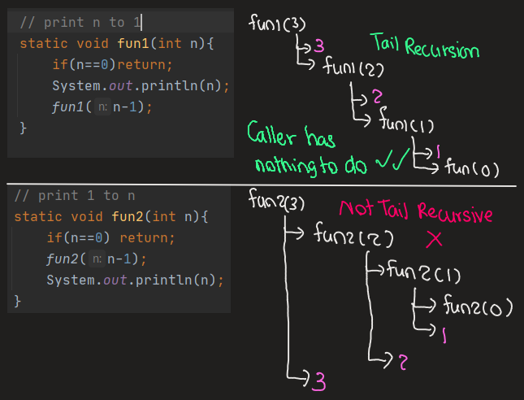

# Java - Data Structure and Algorithms and LeetCode Problems

This repo contains the collection of java collections notes and leetcode coding challenges exercises that I am currently studying to learn more about Data Structure and Algorithms. This repo will be updated progressively.


## Table of Contents 

The data structure and algorithms concepts and theories, and java methods, core java learnt from each week are detailed under each **_Weekly Learning Summary_**.

**Table of Contents**

```
      Bitwise Operation
      Recursion
      
```

## Bitwise Operation 

- Java data types signed two complement 
  - 
  
  - 
- Bitwise Operators 
  
| Bitwise Operator | Symbol | 
|---|---|
| AND | & | 
| OR | I |
|XOR | ^ |
| << | Signed left shift |
| >> | Signed right shift |
| <<< | There is no unsigned left shift in Java |
| >>> | Unsigned right shift |
- Hamming weight - count of number of set bits it contains 
- Vocabularies 
  - Set bit - 1
  - clear bit - 0
  - most significant bit - left most bit
  - least significant bit - right most bit 
- Unsigned vs Signed integer
  - Signed integer can store both positive and negative.
  - Unsigned integer can store only positive numbers 

**References**
1. Hamming weight, https://en.wikipedia.org/wiki/Hamming_weight
2. Summary of Operators, https://docs.oracle.com/javase/tutorial/java/nutsandbolts/opsummary.html
3. Twos complement: Negative numbers in binary, https://www.youtube.com/watch?v=4qH4unVtJkE

## Recursion

- **Recursion :** A function calls itself directly or indirectly 
  - Direct 
  - Indirect - from another function - not common 
- **Base case :** There should be at someone , the function should stop calling itself, it is called base case.
- **Recursion basic format :** {
  - function(...)
  - base cases (one or many)
  - some code.....
  - recursive call(i.e. call for function())
  - With at least one change in parameter 
  - ....
  - }
- **Applications :** Many algorithms techniques are based on recursion. Any problems which can be solved by iteration can also be solved by recursion. They are:
  - Dynamic Programming
    - Memoisation 
    - Tabulation 
  - Backtracking 
  - Divide and Conquer
    - Binary Search
    - Quick Sort 
    - Merge sort 
  - Many problems are inheritly recursive 
    - Tower of Hanoi
    - Depth First Search based traversals(DFS of graph, Inorder, Preorder and Postorder traversal of tree)
      - Finding folders, or files in computer - DFS 
- **Recursive call visualisation :**
  - 

- **Tail Recursion and Tail call elimination :** 
  - In traditional recursion, the typical model is that you perform your recursive calls first, and then you take the return value of the recursive call and calculate the result. In this manner, you don't get the result of your calculation until you have returned from every recursive call.
  - In tail recursion, you perform your calculations first, and then you execute the recursive call, passing the results of your current step to the next recursive step. This results in the last statement being in the form of (return (recursive-function params)). Basically, the return value of any given recursive step is the same as the return value of the next recursive call. [What is tail recursion?, StackOverflow](https://stackoverflow.com/questions/33923/what-is-tail-recursion)
  - Tail recursion is favoured since it takes less time and less auxillary space.

  

- **Quicksort and DFS (Preorder, order) :**
  - Quicksort is faster than mergesort due to tail recursion 
  - DFS (preorder, inorder) => tail recursive , Therefore preorder and inorder traversals should be preferred over postorder.
  - DFS (postorder) => Not tail recursive

- **Writing base cases :**
  - To prevent stackoverflow error in Java 


## References

- DSA-Self Paced with Doubt Assistance, GeeksForGeeks, https://practice.geeksforgeeks.org/courses/dsa-doubt-assistance?vC=1
- Data Structures in Java - Part I (+INTERVIEW QUESTIONS) , https://www.udemy.com/course/algorithms-and-data-structures/
- Nick White YouTube channel, https://www.youtube.com/watch?v=U6-X_QOwPcs&list=PLU_sdQYzUj2keVENTP0a5rdykRSgg9Wp-
- Kevin Naughton Jr YouTubr channel, https://www.youtube.com/c/KevinNaughtonJr/playlists
- Programming Notes, https://www3.ntu.edu.sg/home/ehchua/programming/index.html#Java

  
