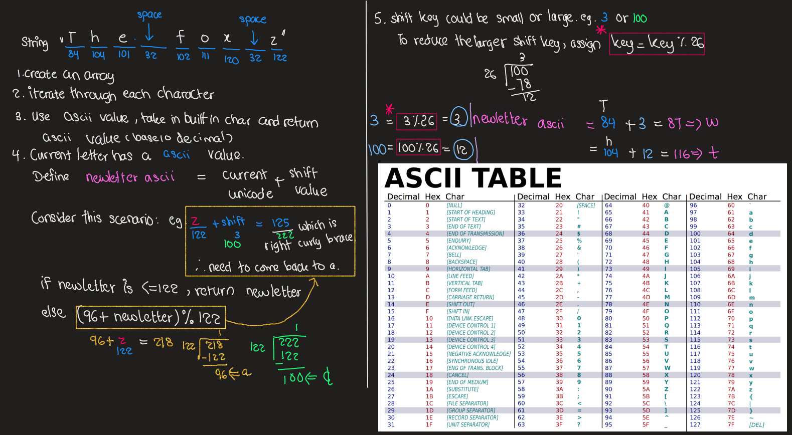

# Java - Data Structure and Algorithms and LeetCode Problems

This repo contains the collection of java collections notes and leetcode coding challenges exercises that I am currently studying to learn more about Data Structure and Algorithms. This repo will be updated progressively.


## Coding Challenges

The data structure and algorithms concepts and theories, and java methods, core java learnt from each week are detailed under each **_Weekly Learning Summary_**.

**Table of Contents**

```
      -------------------------------
      Week 1: Strings
        Leetcode String problems
           1. 344. Reverse String
           2. 125. Valid Palindrome
           3. 657. Robot Return to Origin
           4. 520. Detect Capital
           5. 67. Add Binary
           6. 14. Longest Common Prefix
           7. 680. Valid Palindrome II
          
        Addtional String Problems
            Caesar Cipher Encryption 
            Pattern Matching

      -------------------------------
      Week 1: Array and ArrayList 
          Array Theories
          Practice Questions
      ------------------------------
      Week 1: Linked List
          Linked List Theories
          Practice Questions
      ------------------------------
      Week 1: Mathematical Questions
          Find digit Counts in a number
              Iterative approach-Time O(n)
              Recursive approach-Time O(n)
              Logarithmic approach-Time O(1) **
              Converting to String and count-Time O(n)
          Arithametic Progression
          Geometric Progression
          Leetcode 204: Count Primes


```

## Week - 1

### Leetcode String problems 

The Leetcode String problems numbers and links are below.

1. <a href="https://leetcode.com/problems/reverse-string/" target="_blank">344. Reverse String</a>
   - Algorithm Pseudocode 
    - 
2. <a href="https://leetcode.com/problems/valid-palindrome/" target="_blank">125. Valid Palindrome</a>
   - Algorithm Pseudocode 
    - 
    - [Character class](https://docs.oracle.com/javase/tutorial/java/data/characters.html)
    - Use a char as an object 
    - Character object as a wrapper class and it contains a single field (char type).
    - Autoboxing and Unboxing
      - Pass a primitive char into a method that expects an object
      - The compiler automatically converts to a Character for you.
      - Useful methods in the Character Class
        - isLetterorDigit
        - isUpperCase
        - toUpperCase
        - toString
3. <a href="https://leetcode.com/problems/robot-return-to-origin/" target="_blank">657. Robot Return to Origin</a>
  - Algorithm Pseudocode 
    - 
    - This is one of the most fun challenges to solve 👩‍💻🥰.
4. <a href="https://leetcode.com/problems/detect-capital/" target="_blank">520. Detect Capital</a>
   - Algorithm Pseudocode 
    - 
5. <a href="https://leetcode.com/problems/add-binary/" target="_blank">67. Add Binary</a>
6. <a href="https://leetcode.com/problems/longest-common-prefix/" target="_blank">14. Longest Common Prefix</a>
7. <a href="https://leetcode.com/problems/valid-palindrome-ii/" target="_blank">680. Valid Palindrome II</a>

**Addtional String Problems**

8. Caesar Cipher Encryption 
  - Algorithm Pseudocode 
    - 
9. Pattern Matching
  - Algorithm Pseudocode 
    -  


The coding solutions are in the [String folder](src/strings).
### Week 1: Strings Methods

- String in Java is a Class, but it is almost used like primitive data types such as int, float, long, etc.
- String is a collection of characters. 

- [String methods](https://www.tutorialspoint.com/java/lang/java_lang_string.htm)

- **[java.lang.Character.isLetterOrDigit(char ch)](https://www.tutorialspoint.com/java/lang/character_isletterordigit.htm)**
  - The java.lang.Character.isLetterOrDigit(char ch) determines if the specified character is a letter or digit.
  - A character is considered to be a letter or digit if either Character.isLetter(char ch) or Character.isDigit(char ch) returns true for the character.
  - String.charAt(i)
- **Two Pointer Technique - one of the techniques**

  - int pointer i, increment
  - int pointer j, decrement

- **[java.lang.String.valueOf(char[] data)](https://www.tutorialspoint.com/java/lang/string_valueof_chararray.htm)**

  - The java.lang.String.valueOf(char[] data) method returns the string representation of the char array argument.
  - The contents of the character array are copied and subsequent modification of the character array does not affect the newly created string.

- \***[String toCharArray() Method](https://beginnersbook.com/2013/12/java-string-tochararray-method-example/)**\*\*

  - The method toCharArray() returns an Array of chars after converting a String into sequence of characters.
  - The returned array length is equal to the length of the String and the sequence of chars in Array matches the sequence of characters in the String.

```
    public class CharArrayExample{
        public static void main(String args[]){
                String str = new String("Welcome to BeginnersBook.com");
                char[] array= str.toCharArray();
                System.out.print("Content of Array:");
                for(char c: array){
                    System.out.print(c);
                }
            }
    }
```
- Commonly Used methods 
  - int length()
  - String toLowerCase()
  - String toUpperCase()
  - String trim()
  - String substring(int begin)
  - String substring(int begin, int end)
  - String replace(char old, char new)
  - boolean startsWith(String s)
  - boolean endsWith(String s)
  - char charAt(int index) - return the char value at that particular index
  - int indexOf(String s)
  - int lastIndexOf(String s)
  - boolean equals(String s)
  - boolean equalsIgnoreCase(String s)
  - int compareTo(String s)
  - String valueOf(int i)

- length() vs length in Java
  - array.length : To obtain the array size and can be used for char[], double[], String[]
  - string.length() : length of the string and can be used for String, StringBuilder, etc.
    ```
    int[] array = new int[4]; 
        System.out.println("The size of the array is " + array.length); 

    String str = "Oishii"; 
    System.out.println("The size of the String is " + str.length()); 
  
    ```
### Week - 1: Arrays

In this week, the data structure is **Arrays**. Therefore 7 leetcode easy array questions were selected for practice. The problems numbers and links are below. (In progress)

### Arrays
- Abstract Data types
  - Model (logical description) for a certain data structure
  - Supertype in programming (interface in Java)
  - We define what methods / functions the data structure will have, so we define the basic behaviour 
  - It is just the model.
  - ADT does not specify the concrete implementation or programming language 
  - It is what the user knows.
  - For example
    - stack
      - push( )
      - pop( )
      - peek( ) 
  - Data structure are concrete implementation.
  - Acutal representation of the data 
  - The aim is to be able to store and retrive data in an efficient manner
  - What we want: 
    - insert/ find items in O(1) Time 
    - retrieve O(1) time
  
  | Abstract Data Types | Data Structures implementation |
  |---|---|
  | Stack | array, linked list |
  | Queue | array, linked list |
  |Priority Queue | heap| 
  | Dictionary/ Hashmap | array | 

  - Abstract data types are specifications.
  - Every abstract data type has data structure that will implement abstract data type.
- Arrays - A collection of elements/ values each identified by an array index or key.
  - index starts at 0
  - because of the indexes, random access is possible.
- Multidimensional array: very important for mathematical related computations (matrixes)
- numbers[][] two dimensional array
  - First parameter : row index 
  - second : column index
- Arrays are data structures in order to store items of the same type
- Use indices as key
- Arrays can have as many dimensions as we want: 1D or 2D arrays are quite popular 
- e.g. Storing a matrix -> 2D Array 
  - Dynamic array: size of the array is changing dynamically
  - Applications: Lookup tables/ hashtables, heaps
  - Abstract data structure such as Hashtable, heaps use array as underlying data structure.

- **Advantages of Array :** You can use random access because of the keys
  - getItem(int index) will return the value of the given key. It is very fast O(1)
  - Very easy to implement and to use
  - Very fast data structure 
  - You should use arrays in applications when you want to add items over and over again and want to take items with given indexes.
- **Disadvantages of Array :** You have to know the size of the array at compile-time
  - It is not a dynamic data structure.
  - If it is full, you have to create a bigger array and have to copy the values one by one
  - Therefore reconstructing an array is O(n) operation
  - It is not able to store items with different types
- **Arrays Operations :**
  - Add values to the array as long as the array is not full 
    - add( 12 )
    - add( 34 )
    - add( 120 )
    - add( -5 )
    - Insert at the end O(1) Time complexity 
  - Insert item at a given value at a given index 
    - index (23, 1) 
    - Need to shifts values in order to insert the new one
    - Therefore O(n) Time 
  - Remove the last item 
    - removeLast O(1)
    - removeValueAtGivenIndex O(n)
- **ArrayList :** It is one of the implementations of the list interface
  - An array stores the values in the background 
  - int[] array = new int[10];
  - random access / very fast O(1)
    - Random access : accessing items by the index | list.get(0)
  - It is equivalent to Vector but ArrayList is not synchronised.
  - All operations run in O(n) Time
  - But to remove the items, this operation is not so efficient because you need to shift each item in the list O(n)
  - If the application is just about adding elements to a list and getting elements with known indexes, then use arraylist
  - Capacity
    - It is a parameter you can define when you instantiate an ArrayList
    - It is the initialise size of the array
    - If you already know that you will store 5 million items in list, you should use with that size to void the incremental rellocation. (to reduce the amount of incremental rellocation)
    - list = new ArrayList(5000000)
- **Arrays :**
- Fundamental building blocks for all other data Structures
  - There are two types of Arrays: Static and Dynamic Arrays
- **Static array :** is a fixed length container containing n elements indexable from the range [0, n-1].
- **indexable :** means that each slot/ index in the array can be referenced with a numbes. Static array are given as contagious chunck of memory.
- **When and where is a static Array used?**
  - Storing and accessing sequential data
  - Temporarily storing objects - most commonly used 
  - Used by IO routines as buffers
    - Store information from input and output streams 
    - If files are too large to fit in the memory, use Buffer to read small chunks 
  - Lookup tables and inverse lookup tables
    - Due to array's indexing properties, you can retrieve data from the table.
  - Can be used to return multiple values from a function
    - Find way around in the programming lanaguge that allow for only single return value. 
    - Use as pointer and return the values 
  - Used in dynamic programming to cache answers to subproblems 
    - [Knapsack problem](https://en.wikipedia.org/wiki/Knapsack_problem)
      - [Knapsack problem lecture notes for later reference](https://www2.cs.duke.edu/courses/spring19/compsci330/lecture4scribe.pdf)
    - Queen check problem
- **Complexity :**
  
  | Operation | Static Array | Dynamic Array |
  |---|---|---|
  |Access | O(1) | O(1)|
  |Search | O(n) | O(n)|
  |Insertion | N/A | O(n)|
  |Appending | N/A | O(1)|
  |Deletion | N/A | O(n)|

  - Static Array: Insertion, Appending, Deletion do not apply to static array since it is a fixed size.
  - Dynamic Array : needs to shift the elements for both insertion and deletion.
- Array 
    ```
    A = {44, 12, -5, 17, 6, 0, 3, 9, 100}   <- Array
          0   1   3   3  4  5  6  7   8     <- Indexing
    A[0] = 44 , [] square bracket denotes the indexing 
    A at position 0 

    ```
- **Operations on Dynamic Array**
  - The dynamic array can grow and shrink in size.
  - A = {34, 4}
  - A.add(-7)      A = {34, 4, -7}
  - A.add(34)      A = {34, 4, -7, 34}
  - A.remove(4)    A = {34, -7, 34}

- **Implement Dynamic Array** 
  - One of the most common way to implement is to use a static array.
    - Create a static array with an initial capacity
    - Add elements to the underlying static array, keeping track of the number of elements
    - If adding another element will exceed the capacity, then create a new static array with twice the capacity and copy the original elements into it.
- **Why is it important that we grow the size of the dynamic array exponentially when resizing?**
  - It is to keep the time complexity of insertions O(1). If we grow the array at an exponential rate, the cost of inserting as well as resizing becomes neglibigle.
### Arrays Arrays Interview Questions

**LeetCode**
1. <a href="https://leetcode.com/problems/two-sum/" target="_blank">1. Two Sum</a>
  - Algorithm Pseudocode 
    - 
    - 
**Array Practice Questions**

*Single Dimensional Array*

1. Find the largest element in the array 
2. Find an element in the array 
3. Sort an array in ascending order
4. Display second largest element in the array with or without sorting the array 
5. Reverse the elements of the array

*Two Dimensional Array* 

6. Add, sub 2D array of 2 x 2 matrix
7. Transpose a matrix 
8. Add all the elements of the matrix 

*Miscellaneous*

9. Find the cube of a number
10. Find the factorial of a number
11. Reverse the digits of a number
12. Check given string is palindrome or not 
13. Check given number is even or odd 
14. Generate 'n' Fibonacci numbers
15. Check given numbers is prime or not
16. Swap two numbers

### Linked Lists

**A Single node**
- contains data -> integer, double or custom object
- contains a reference pointing to the next node in the linked list
- Each node is composed of a data and a reference/ link to the next node in the sequence.
- Simple and very common data structure!
- They can be used to implement several other common data types: stacks, queues
- Simple linked lists by themselves do not allow random acccess to the data , therefore you cannot use indexes to get them.
- Many basic operations such as obtaining the last node of the list or finding a node that contains a given data or locating the place where a new node should be inserted - requires sequential scanning of most or all of the list elements


***Advantages***
- linked lists are dynamic data structures (array are not!)
- It can allocate the needed memory in run time
- Very efficient if we want to manipulate the first elements
- Easy implementation
- can store  items with different sizes : array assumes every element to be exactly the same
- It is easier for a linked list to grow organically. An array' size needs to be known ahead of time or re-created when it needs to grow


***Disadvantages***
- Waste memory because of references
- Node in a linked list must be read in order from the beginning as linked lists have sequential access (array items can be reached via indexes in O(1) time !
- Difficulties arise in Linked Lists when it comes to reverse traversing.
- Singly linked list are extremely difficult to nagivate backwards
- Solution: Doubly linked lists -> easier to read, but memory is wasted in allocating space for a back pointer


### Linked List Operations

- inserting items at the beginning of the linked list
    - very simple, you just have to update the references -> O(1) Time complexity
    - linkedList.insertAtStart(10); 10 Null, insert 4 , point to 10 , set the pointer point to the next node
    - Array is great for random access
- inserting items at the end of the Linked List
    - You have to traverse the whole linked list to find the last node
    - How do you find the last node?
    - You know that the last node is pointing to NULL
    - You have to update the references when you get there O(n) Time
    - linkedList.insertAtEnd(25)
    - 12, 4, 123, -7, 10 , null
    - root of the node is 12. Have to go to the last node. Keep traversing until the pointer is pointing to null
    - 10 needs to point to item to be inserted (25) therefore O(1) + O(n) = O(n)

- Removing at the beginning
    - removing item at the beginning of the list is always very fast
    - you do not have to search the item
    - you have to update the references accordingly
    - O(1)
    - linkedList.removeStart()
- Removing at the given point
    - Search for the given item (which may take a lot of time
    - if the item is at the end of the list, O(n)
    - linkedList.reove(10)

- Doubly Linked List
    - We can get from 4 to 25 because we just have to hop to the next node.
    - Node class has two references, one pointing to the next node, one pointing to the previous node
    - It is not memory friendly, you have to store lots of references
    - But there is not need to track the previous node during traversal


### Linked List vs Array
**Searching**
  - Search operation yields the same result for both data structure
  - ArrayList search operation is pretty fast compared to LinkedList search operation
  - You can use random access arrays : getItem( int index) which is O(1) Time
  - LinkedList performance is O(n) Time
  - WHy?
  - ArrayList maintains index based system for its elment as it uses array data structure implicitly which makes it faster for searching an element in the list
  - On the other hand LinkedList requires the traversal through all the items for searching an element

**Deletion**
  - LinkedList remove operation takes O(1) time if we remove items from the beginning and usually this is the case
  - ArrayList : removing first element ( so at the beginning) takes O(n) time, removing the last item takes O(1) times
  - But on average, we have to reconstruct the array when removing
  - Therefore in conclusion, linkedlist is better for this option
  - Why?
  - Linked List basically operates with pointers : removal only requires change in the pointer location which can be done very fast
  
**Memory Management**
  - Arrays do not need any extra memory
  - LinkedList do need extra memory because of references / pointers
  - In this aspect, arrays are better, they are memory friendly.

| Operation   |            LinkedList  |            Arrays|
|---|---|---|
|Insert at the start |    O(1)  |                   O(n)|
|Insert at the end |      O(n)   |                  O(1)|
|Waste space     |        O(n)  |                   0|


**Interface**
- Interface is another way to achieve abstraction. 
- An interface is a completely abstract class that is used to group related methods with empty bodies.
- To access the interface methods, the interface must be implemented by another class with *implements* keybord.
- Interface cannot be used to create objects. 
- Interface does not have body.
- On implementation of an interface, you must override all of its methods. 
- Interface methods are by default abstract and public.
- Interface attributes are by default public, static and final. 
- Interface cannot contain a constructor. 
- 

**Why and When to use Interface?**
- To achieve security - hide certain details and only show the important details of an object (interface)
- You can achieve multiple interitance in Java via interface and implement multiple interfaces.


**Doubly Linked Lists**
- Doubly linked list are composed of nodes and references / pointeres from one node to the other!!
- The last and first references are pointing to a NULL
- You can access to the head
- You can access to tail as well.
- Single node
  - contains data -> integer, double or custom object
  - contains a reference pointing to the next node in the linked list
  - contains a reference pointing to the previous node in the linked list
- class Node {
  - data 
  - Node nextNode
  - Node previousNode
- }
- Singly Linked List
  - can only access from head ONLY => 12, 4, 123, -7, 25, NULL 
  - Time O(n)

  ```
      removeSingle(Node node, Node previousNode){
        tempNode = head;
        while (tempNode != null){
          if(tempNode == node){
            previousNode.nextNode = tempNode.nextNode;
            tempNode = null;
            return;
          }
          previousNode = tempNode;
          tempNode = tempNode.nextNode;
        }
      }
  ```
- Doubly Linked List
  - 7, 1, 10, -2, 2 
  - You don't need to traverse through the list
  - If you know the node you want to get rid of, you can update the reference because you can access the previous node with reference!

    ```
    removeDouble(Node node){
      node.previousNode.nextNode = node.nextNode;
      node.nextNode.previousNode = node.previousNode;
    }
    ```
**Advantages of Doubly Linked List**
  - a doubly linked list can be traversed both directions: forward and backward
  - the remove operation is more efficient if the node is given
  - for singly linked lists, you need the previous node.
  - to find it, you need to traverse the whole list
    - to remove a node from a singly linked list, you need the node + predecessor
    - to remove a node from a doubly linked list, you need the node 
  

**Collectoins**
- Iterable
  - Collection 
    - List
      - ArrayList
      - LinkedList - can implement queue and deque
      - Vector
        - Stack
    - Queue
      - Deque
      - ArrayDeque
      - PriorityQueue
    - Set 
      - Hashset
      - LinkedHashSet
      - SortedSet
      - TreeSet

**Real World practical applications of Linked List**
- Operating system uses almost all the important data structures.
  - Low level memory management 
    - Linked lists are important in low level memory management when dealing with C programming 
      - malloc() : allocate memory into heap
      - free() : free the memory 
    - With these built-in functions, we can manipulate the heap memory
      - char * char_ptr = (char*)malloc(30); // allocates 30 bytes of memory in the heap
    - Header  -> Header -> Header
    - B       -> B      -> B
    - O       -> O      -> O
    - D       -> D      -> D
    - Y       -> Y      -> Y
  - For more info, go to [this link](https://wiki.syslinux.org/wiki/index.php?title=Heap_Management).
- Windows application 
  - Alt + tab
  - All the tabs are linked together with linked list
- PhotoViewer - images are linked together
- Blockchains (bitCoin) - blockchain is basically a simple linked list where blocks are cryptographically linked together.
  - So the blockchain itself is a linked list with hash pointers
  - Every node in the blockchain has 2 hash values
    - Own hash
    - Hash value of the previous block 

### Week 1: Mathematical Questions 

- Find digit Counts in a number (See java file)
  - Iterative approach-Time O(n)
  - Recursive approach-Time O(n)
  - Logarithmic approach-Time O(1) **
  - Converting to String and count-Time O(n)
- **Arithmetic progression :** if the difference between any two consecutive terms are always the same, a sequence of numbers are said to be arithmetic progression
  - e.g.1, 4, 7, 10, 13, 16
  - Initial term is the first number = a1 
  - Common difference = d 
  - **Find nth term of an arithmetic progression** 
  - an = a1 + (n -1) d
    - an = nth term
    - a1 = first term
    - n = term position 
  - Find sum of first n terms of Arithmetic progression
    - Sn = n/2 [2a + (n-1)d]
      - Sn = sum of a term
      - a = first element
      - d = common difference 
      - n = numberof terms
    - Arithmetic mean = Sum of all terms / number of terms 
    - Sum of 'n' terms = n/2(first term + last term) = n/2[2a + (n-1)d]
- **Geometric Progression :** The ratio of any two consecutive terms are always the same.
- The next number in the series is calculated by multiplying a fixed number to the previous number in the series 
- 2, 4, 8, 16, 32
- 110, 220, 440, 880, 1760 (x 2)
- If common ratio is positive -> the terms will be the same sign as the initial term
- If common ratio is negative -> alternate between positive and negative.
- an = a1 * r^n-1
- Sum of nth term 
  - Sum = a(r^n -1)/ r-1
    - r = common ratio
    - n = number of terms
    - sum = sum of all geometric progression
- **Leetcode 204: Count Primes**
  - Approach 1 
    - 

## References

- Data Structures in Java - Part I (+INTERVIEW QUESTIONS) , https://www.udemy.com/course/algorithms-and-data-structures/
- Java.lang.Character.isLetterOrDigit() Method, https://www.tutorialspoint.com/java/lang/character_isletterordigit.htm
- Java tutorial: Learn Java Programming with examples, https://beginnersbook.com/java-tutorial-for-beginners-with-examples/
- Java Comparable Interface, https://www.javatpoint.com/Comparable-interface-in-collection-framework
- Leetcode: Count Primes , http://buttercola.blogspot.com/2015/08/leetcode-count-primes.html
- Nick White YouTube channel, https://www.youtube.com/watch?v=U6-X_QOwPcs&list=PLU_sdQYzUj2keVENTP0a5rdykRSgg9Wp-
- Kevin Naughton Jr YouTubr channel, https://www.youtube.com/c/KevinNaughtonJr/playlists
- Programming Notes, https://www3.ntu.edu.sg/home/ehchua/programming/index.html#Java
- Program to count digits in an integer (4 Different Methods), https://www.geeksforgeeks.org/program-count-digits-integer-3-different-methods/
- Stressed Desserts Palindrome photo, https://9gag.com/gag/4442060
- Robot illustration, Icons made by <a href="https://www.flaticon.com/authors/freepik" title="Freepik">Freepik</a> from <a href="https://www.flaticon.com/" title="Flaticon"> www.flaticon.com</a>

  
