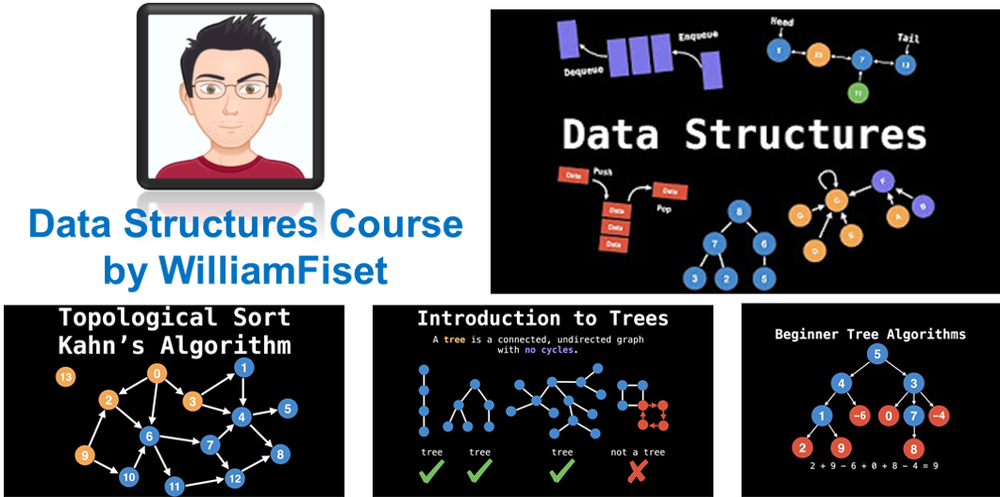

# Java - Data Structure and Algorithms YouTube course by William Fiest

This repo contains the notes and java code files I have taken while doing the [Data Structure and Algorithm course by William Fiest](https://www.youtube.com/watch?v=RBSGKlAvoiM). This is his's [GitHub repo](https://github.com/williamfiset/Algorithms/tree/master/src/main/java/com/williamfiset/algorithms).





**Table of Contents**

```
      -------------------------------
      Section 1 : Introduction 

      Section 2 : Static and Dymaic Arrays

      -------------------------------

```

## Section 2 : Static and Dynamic Arrays

- **Arrays :** Fundamental building blocks for all other data Structures
  - There are two types of Arrays: Static and Dynamic Arrays
- **Static array :** is a fixed length container containing n elements indexable from the range [0, n-1].
- **indexable :** means that each slot/ index in the array can be referenced with a numbes. Static array are given as contagious chunck of memory.
- **When and where is a static Array used?**
  - Storing and accessing sequential data
  - Temporarily storing objects - most commonly used 
  - Used by IO routines as buffers
    - Store information from input and output streams 
    - If files are too large to fit in the memory, use Buffer to read small chunks 
  - Lookup tables and inverse lookup tables
    - Due to array's indexing properties, you can retrieve data from the table.
  - Can be used to return multiple values from a function
    - Find way around in the programming lanaguge that allow for only single return value. 
    - Use as pointer and return the values 
  - Used in dynamic programming to cache answers to subproblems 
    - [Knapsack problem](https://en.wikipedia.org/wiki/Knapsack_problem)
      - [Knapsack problem lecture notes for later reference](https://www2.cs.duke.edu/courses/spring19/compsci330/lecture4scribe.pdf)
    - Queen check problem
- **Complexity :**
  
  | Operation | Static Array | Dynamic Array |
  |---|---|---|
  |Access | O(1) | O(1)|
  |Search | O(n) | O(n)|
  |Insertion | N/A | O(n)|
  |Appending | N/A | O(1)|
  |Deletion | N/A | O(n)|

  - Static Array: Insertion, Appending, Deletion do not apply to static array since it is a fixed size.
  - Dynamic Array : needs to shift the elements for both insertion and deletion.
- Array 
    ```
    A = {44, 12, -5, 17, 6, 0, 3, 9, 100}   <- Array
          0   1   3   3  4  5  6  7   8     <- Indexing
    A[0] = 44 , [] square bracket denotes the indexing 
    A at position 0 

    ```
- **Operations on Dynamic Array**
  - The dynamic array can grow and shrink in size.
  - A = {34, 4}
  - A.add(-7)      A = {34, 4, -7}
  - A.add(34)      A = {34, 4, -7, 34}
  - A.remove(4)    A = {34, -7, 34}

- **Implement Dynamic Array** 
  - One of the most common way to implement is to use a static array.
    - Create a static array with an initial capacity
    - Add elements to the underlying static array, keeping track of the number of elements
    - If adding another element will exceed the capacity, then create a new static array with twice the capacity and copy the original elements into it.
- **Why is it important that we grow the size of the dynamic array exponentially when resizing?**
  - It is to keep the time complexity of insertions O(1). If we grow the array at an exponential rate, the cost of inserting as well as resizing becomes neglibigle.

### References

- William Fiset, Algorithms GitHub repository, https://github.com/williamfiset/Algorithms/tree/master/src/main/java/com/williamfiset/algorithms
- Data Structure and Algorithm course by William Fiest, https://www.youtube.com/watch?v=RBSGKlAvoiM
- 
 
  
